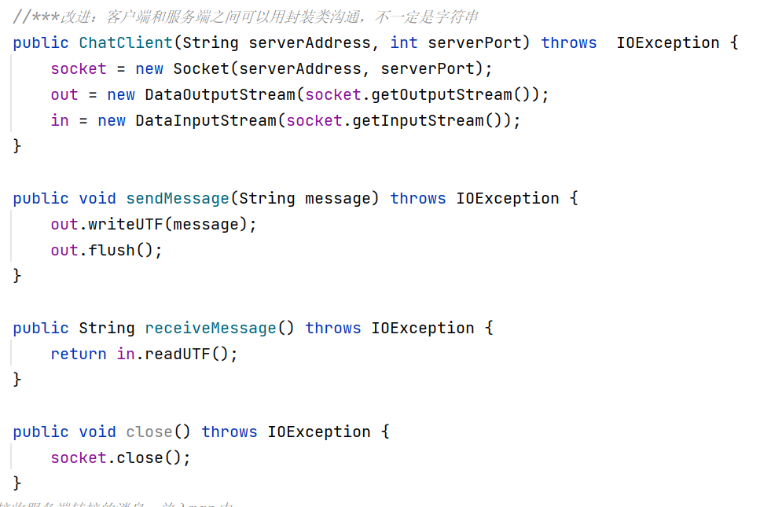

## socket编程
### 服务器端：
- 通过创建ServerSocket对象并指定端口号来等待客户端连接。一旦有客户端连接，它接受客户端的连接请求，并创建一个与客户端通信的Socket对象。同时，我们会为这个Socket对象创建一个对应的ChatHandler线程，用于与特定的客户端通信。

- 在ChatHandler类中我们实现一个自定义协议。Handler类通常用于处理客户端连接和数据交换的逻辑。它负责接收客户端请求、处理数据和发送响应。我们利用while(true)对客户端请求的持续接收，在executeCommand()中实现具体数据处理逻辑。
- 使用Handler类或多线程技术。这样可以使每个客户端连接都在独立的线程中处理，从而允许服务器同时处理多个连接并提高整体性能。否则服务器无法同时处理多个客户端请求。

### 客户端：
- 客户端通过创建Socket对象并指定服务器的地址和端口号来连接到服务器。
- 它也获取输入流和输出流来与服务器进行通信。

